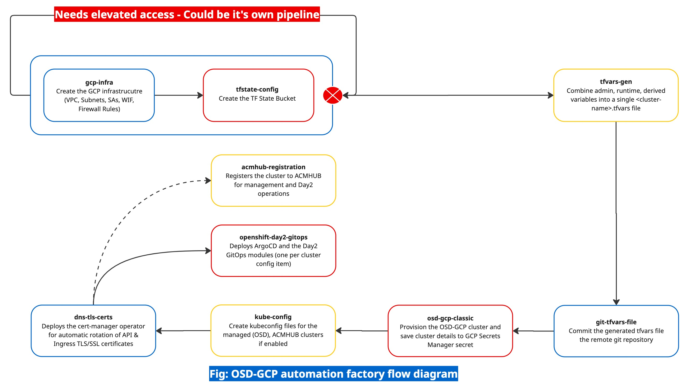
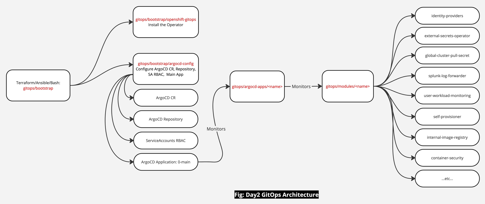

# OSD Classic on Google Cloud cluster automation

## Pre-Requisites

### Bastion host
- OpenShift Cloud Manager CLI
- [GoLang](https://go.dev/doc/install) - 1.20.x or greater
- [Terraform](https://developer.hashicorp.com/terraform/install#linux) 1.9.x or greater
- [GCloud CLI](https://cloud.google.com/sdk/docs/install)
- [jq](https://jqlang.github.io/jq/download/)
- Up to date [Openshift Client](https://mirror.openshift.com/pub/openshift-v4/amd64/clients/ocp/latest/)
- [Helm](https://helm.sh/docs/intro/install/)
- Network connectivity to https://api.openshift.com/
- Network connectivity into your Google Cloud environment

### Account access level
- [Detailed List](https://docs.redhat.com/en/documentation/openshift_dedicated/4/html-single/planning_your_environment/index#ccs-gcp-customer-requirements_gcp-ccs)

### Execution level
- User/ServiceAccount with permission to:
  - Create VPCs, Subnets, Compute resources..etc
  - Create Storage Bucket
  - Create, Delete OSD
  - Optional: Create a DNS Zone and add A, NS records to it 
- Subnets tagged with `cluster_name`
  - `x.x.x.x/24` or larger CIDR for Multi-AZ
  - `x.x.x.x/25` or larger CIDR for Single-AZ
  
- Optional: Base DNS Domain name - `openshiftapps.com` will be used if you do not specify one.
- Optional: Base DNS Zone deployed with resulting name servers registered to the domain registrar. It's name or subdomain name should match the base_dns_zone name.
- [ocm token](https://console.redhat.com/openshift/downloads)
  - Place the token string in Secret Manager and set the `TF_VAR_ocm_token_secret_name` variable to the secret name. 
- git PAT stored in GCP Secrets Manager, set the secret name to the `TF_VAR_git_token_secret_name` variable.
- Firewall inbound rules defined; this is to allow traffic from parties that need to connect to the cluster. For example, the CI/CD platform hosts, and any other IP ranges that will need ingress access the cluster.


## Execution Flow




## Admin variables

These are the cross-module [variables](./tfvars/admin/admin.tfvars), common across business-units/departments.

## User input variables

[Variables](.ci/user-inputs.sh) the user provides during the execution of the pipeline.

## Derived variables

These are the variables that change based on user inputs.

## Custom domain TLS certificates

The guide uses the [cert-manager](https://docs.openshift.com/container-platform/4.14/security/cert_manager_operator/index.html) operator to automate custom domain TLS/SSL certificates creation, rollout and rotation.

To learn the logic behind the implementation, read [this](https://cloud.redhat.com/experts/aro/cert-manager/) article.

## Terraform Modules

Listed in their order of precedence, they work together to provision an OSD-GCP classic cluster, make necessary configurations and then register the cluster to ACM for day-2 configurations and management. However, by default the CI pipeline script does not do ACM-HUB registration, instead it deploys the OpenShift GitOps operator (ArgoCD), apply the necessary configurations such as adding a repository, RBAC configuration. The day-2 GitOps configuration code is located inside the [gitops](./gitops/) directory.

- [tfstate-config](./tfstate-config/): Create a storage bucket for storing the Terraform state files.

- [gcp-infra](./gcp-infra/): This module deploys the infrastructure resources that must exist before a cluster can be deployed. The following resources will be created: VPC, Control & Worker Subnets, Firewall Rules to allow traffic from the CICD/Bastion hosts, and a Service Account with required roles for cluster components interaction with GCP services. 

- [tfvars-prep](./tfvars-prep/): Combine admin, user inputs, and derived variables into a single tfvars file. All subsequent modules will use that file.

- [git-tfvars-file](./git-tfvars-file/): Commit the master tfvars file to GitHub. Feel free to change the repo location to GitLab, BitBucket...etc.

- [osd-gcp-classic](./osd-gcp-classic/): Creates the OSD cluster, add a cluster-admin account for initial cluster access, save the cluster details including admin account info to a GCP SM secret.

- [dns-tls-certs](./dns-tls-certs/): This module deploys the cert-manger operator, configure the ACME TLS/SSL issuer to issue certs for the cluster API and Ingress, update the base dns domain to add NS and A records.
  - Note, deploying the TLS certificates for the custom domain should be part of day-2 configurations using GitOps practices. Read [here](https://cloud.redhat.com/experts/aro/cert-manager/) to learn more.
- [acmhub-registration](./acmhub-registration/): Registers the cluster to  ACM-HUB.

- [gitops/bootstrap](./gitops/bootstrap/): Deploys and configure the OpenShift GitOps operator. Configurations such as adding a repository, RBAC, App of apps pattern are configured after the Operator deployment; each helm chart in the `gitops/modules` directory is a cluster configuration item.

  

  - [gitops/modules](./gitops/modules/): Cluster Day2 configuration items are implemented using GitOps patterns. Each configuration item represents a module packaged as a Helm chart.
  - [gitops/argocd-apps](./gitops/argocd-apps/): The Helm chart that defines the ArgoCD applications manifests used for the deployment of the Day2 configuration modules; one ArgoCD `Application` CR per Day2 module.

## Cluster Build

### 1. GitHub repository and PAT token

For the pipeline to work end-to-end, a Git (public/private) repository is required. If the repository is private, a PAT token with write access to the repository is required as well.

> [!NOTE]
> 
> It does not have to be GitHub SCM only. We can switch SCM providers by updating the [git-tfvars-file](./git-tfvars-file/); replacing the GitHub specific configs by whatever SCM vendor we want.

### 2. Optional: Provision the base domain DNS Zone - TODO: Add GCP docs

This step is only required in the absence of a DNS Zone instance. In a production environment, the root DNS zone would already exist.

1. Create the Base DNS Zone instance

    This step should be skipped if there is a base DNS Zone already setup. Keep in mind, the base DNS Zone could be a child zone to the root zone.

2. Record the DNS Zone assigned name servers

3. Delegate the name servers to your domain registrar

4. Verify root DNS Zone domain is resolvable

    ```sh
    nslookup -type=NS openshift.sama-wat.com

    Server:         100.64.100.1
    Address:        100.64.100.1#53

    Non-authoritative answer:
    openshift.sama-wat.com  nameserver = ns1-02.azure-dns.com.
    openshift.sama-wat.com  nameserver = ns2-02.azure-dns.net.
    openshift.sama-wat.com  nameserver = ns3-02.azure-dns.org.
    openshift.sama-wat.com  nameserver = ns4-02.azure-dns.info.

    Authoritative answers can be found from:
    ```

### 3. Optional: Register cluster dedicated child DNS Zone name servers to domain registrar

> [!NOTE]
> 
> This step would be implemented differently in the case of a private cluster; however, the logic would remain pretty much the same.

As part of the cluster build, the automation script will create child DNS zone instance, add an NS record for the child DNS Zone to the base DNS Zone. The DNS zone transfer to the domain registrar is not automated; this step could be automated as well.

Domain patterns:

- Child DNS Zone: `<cluster_name>.<platform_environment>.<location>.<organization>.<base_dns_zone_name>`

- API Server domain: `api.<cluster_name>.<platform_environment>.<location>.<organization>.<base_dns_zone_name>`

- Console URL domain: `console-openshift-console.apps.<cluster_name>.<platform_environment>.<location>.<organization>.<base_dns_zone_name>`

- Default routes domain: `*.apps.<cluster_name>.<platform_environment>.<location>.<organization>.<base_dns_zone_name>`

1. Child DNS Zone details

2. Register the cluster child DNS Zone to domain registrar

3. Verify Cluster (child) DNS Zone domain is resolvable
   
    ```sh
    nslookup -type=NS osd-classic-101.dev.eastus.poc2357.openshift.sama-wat.com
    Server:         100.64.100.1
    Address:        100.64.100.1#53

    Non-authoritative answer:
    osd-classic-101.dev.eastus.poc2357.openshift.sama-wat.com       nameserver = ns1-06.azure-dns.com.
    osd-classic-101.dev.eastus.poc2357.openshift.sama-wat.com       nameserver = ns2-06.azure-dns.net.
    osd-classic-101.dev.eastus.poc2357.openshift.sama-wat.com       nameserver = ns3-06.azure-dns.org.
    osd-classic-101.dev.eastus.poc2357.openshift.sama-wat.com       nameserver = ns4-06.azure-dns.info.

    Authoritative answers can be found from:
    ```

> [!IMPORTANT] 
> 
> Ensure the base and child domains are resolvable before going further; or else all stages after cluster provisioning will fail because they will not be able to resolve the cluster API server hostname.


### 5. Optional: Save ACM-HUB cluster credentials in GCP SM secret

If the cluster is meant to be managed by ACM-HUB, there is a module that will register the cluster to ACM. However, as the cluster credentials will be fetched by the module, the HUB cluster credentials must be placed in a Secret with a name matching this pattern: `openshift-<OCP_ENV>-acmhub-<ACMHUB_CLUSTER_NAME>`.

The value of the secret must be of json format with the following fields set:

```yaml
{
  "admin_username": "value",
  "admin_password": "value",
  "api_server_url": "value"
}
```

### 6. Verify Admin variables are correct

Admin tfvars file is available [here](./tfvars/admin/admin.tfvars).

### 7. Prepare user inputs

Use the [user-inputs.sh](./.ci/user-inputs.sh) file as reference. All parameters shown in there collectively represent what the user is expected to provide at each pipeline execution. More parameters can be provided if the user opts to shift some admin parameters to be provided at runtime.

> [!NOTE]
>
> The `user-inputs.sh` is used for automating the execution on a local workstation. However, in a proper CI platform, different means of providing user inputs would be utilized; a user input form for example, if GitHub Action was the CI platform.

### 8. Execute the cluster provisioning pipeline

```sh
.ci/pipeline-create.sh .ci/user-inputs.sh | tee cluster-build.log
```

After the cluster provisioning is complete, details such as `console_url, api_usrl, admin_username, admin_password` will be put in a Secret with suffix `<cluster-name>-details`. Search for that secret in the GCP project, copy the content and base64 decode it.

```sh
echo -n "<BASE64_ENCODED_STRING>" | base64 -d > cluster-details.json
```

## Cluster Teardown

At the time of writing these scripts, the TF provider did not properly handle the `terraform destroy` phase; So admins will be required to manually delete the cluster using the ocm-cli or the OCM web console.

```sh
.ci/pipeline-destroy.sh .ci/user-inputs.sh | tee cluster-build.log
```